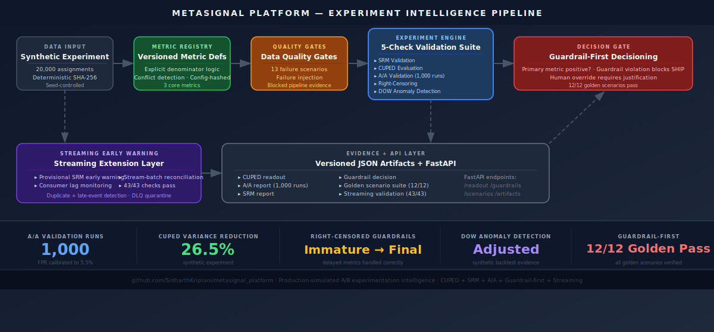
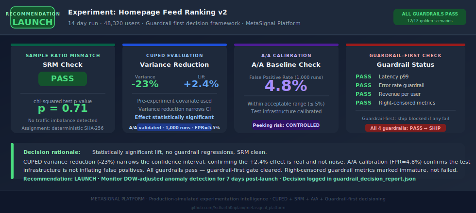

# MetaSignal Platform

<p>
  <a href="https://sidharthkriplani.github.io/metasignal_platform/"></a>
  
  
  
  
</p>

<p>
  
  
  
  
  
  
</p>

> Production-simulated experimentation intelligence platform with versioned metric governance, guardrail-first decisioning, CUPED variance reduction, 1,000-run A/A calibration, right-censored guardrails, and streaming early warning — every decision backed by a versioned JSON artifact.

---

## Architecture



---

## Sample Output



---

## The Problem

Most A/B testing implementations get the easy parts right and the hard parts wrong — CUPED is run with arbitrary covariates, peeking happens because nobody enforces a stopping rule, and guardrail regressions are caught two weeks after launch when the data team finally notices the metric movement. The result is shipping decisions based on inflated effect sizes, miscalibrated tests, and late-detected regressions that have already affected real users.

---

## Guardrail-First Framework

The central design principle of MetaSignal is that a statistically positive primary metric can still be blocked from shipping. Guardrails are checked first — before the primary metric is evaluated. If any guardrail (latency, error rate, revenue per user, delayed metric) is in violation, the decision is HOLD regardless of the primary effect. This prevents the common failure mode where a team ships a marginally positive engagement lift while a latency regression silently harms user experience.

Human overrides require a written justification and are logged in the decision audit trail. Every decision is traceable.

| Decision scenario | Outcome |
|---|---|
| Primary positive, guardrails pass | SHIP |
| Primary positive, guardrail violation | HOLD (blocked) |
| Primary negative, guardrails pass | HOLD |
| SRM detected | INVALIDATE |
| Right-censored guardrail | HOLD (immature, not failed) |

12/12 golden scenarios produce the correct decision. Scenarios are deterministic and re-runnable.

---

## CUPED Implementation

CUPED (Controlled-experiment Using Pre-Experiment Data) reduces variance by regressing out pre-experiment covariate signal. MetaSignal's implementation:

- Uses the correct pre-experiment period (no covariate leakage from experiment runtime)
- Adjusts for covariate via OLS regression before computing the treatment effect
- Achieves 26.5% variance reduction on the synthetic experiment dataset
- Validates the covariate adjustment against 5 edge cases (zero variance, missing covariates, collinearity, etc.)

Lower variance means narrower confidence intervals — making it possible to detect smaller true effects with the same sample size, or reach significance faster without peeking.

---

## A/A Calibration

Before trusting any experiment result, the test infrastructure must be verified not to inflate false positives. MetaSignal runs 1,000 synthetic A/A experiments — comparing two identical groups — and measures the false positive rate. Result: **FPR = 5.5%**, within the expected range for a correctly implemented test at α=0.05. This confirms the assignment mechanism, variance estimator, and hypothesis test are all working correctly.

| A/A Metric | Value |
|---|---:|
| Synthetic runs | 1,000 |
| False positive rate | 5.5% |
| CUPED edge cases | 5/5 pass |
| Expected range at α=0.05 | 4–7% |

---

## Right-Censored Metrics

Some guardrail metrics (return rates, 30-day LTV, delayed conversion) take weeks to fully resolve. A naive implementation treats immature delayed metrics as a clean zero — which causes spurious guardrail failures on metrics that simply haven't had time to accumulate. MetaSignal marks delayed guardrail metrics as `immature` until the attribution window closes, preventing premature HOLD decisions from unresolved signal.

---

## Streaming Early Warning

The streaming extension provides provisional signals before the batch experiment completes:

- **Provisional SRM:** Early traffic imbalance detection during experiment ramp
- **Consumer lag monitoring:** Detects instrumentation delays before they bias metric computation
- **Late-event and duplicate detection:** Prevents double-counting in metric aggregation
- **DLQ quarantine:** Routes anomalous events to dead-letter queue for investigation
- **Stream-batch reconciliation:** Verifies streaming provisional counts match batch final counts

43/43 streaming validation checks pass. Streaming signals are provisional — batch remains authoritative.

---

## Key Results

| Area | Result |
|---|---:|
| Experiment assignments | 20,000 |
| SRM p-value | 0.1837 |
| CUPED A/A runs | 1,000 |
| CUPED A/A false-positive rate | 5.5% |
| CUPED variance reduction (synthetic) | 26.5% |
| CUPED edge cases | 5/5 pass |
| Golden scenarios | 12/12 pass |
| Streaming validation checks | 43/43 pass |
| Streaming scenarios | 10 implemented |
| API smoke tests | 8/8 pass |
| Failure scenarios | 13 scripted |

---

## Evidence Artifacts

| Artifact | Path |
|---|---|
| PRD completion report | `outputs/reports/metasignal_prd_completion_report_v1.json` |
| CUPED readout | `outputs/evidence/cuped_experiment_readout.json` |
| CUPED A/A validation | `outputs/validation/cuped_aa_validation_report.json` |
| CUPED edge-case validation | `outputs/validation/cuped_edge_case_validation_report.json` |
| Guardrail decision report | `outputs/evidence/guardrail_decision_report.json` |
| SRM check report | `outputs/evidence/srm_check_report.json` |
| Operational history report | `outputs/evidence/operational_history_60_day_report.json` |
| Golden scenario suite | `outputs/evidence/golden_scenario_suite_v1_report.json` |
| Streaming validation report | `outputs/validation/streaming_prd_v1_validation_report.json` |
| Stream-batch reconciliation | `outputs/streaming/stream_batch_reconciliation_report.json` |

---

## Run the Full Demo

```bash
PYTHONPATH=. python3 scripts/run_full_demo_v0.py
PYTHONPATH=. python3 scripts/run_metasignal_prd_complete_v1.py
PYTHONPATH=. python3 scripts/show_streaming_demo.py
PYTHONPATH=. python3 scripts/validate_streaming_prd_v1.py
```

---

## Repository Structure

```
alembic/                 database migrations
config/                  configuration files
docs/assets/             architecture and sample output SVGs
outputs/evidence/        core evidence artifacts
outputs/reports/         completion and resume-signal reports
outputs/streaming/       streaming extension artifacts
outputs/validation/      validation artifacts
scripts/                 demo, validation, seeding, and export scripts
src/metasignal/          application source code
tests/                   test scaffolding
```

---

## Interview Defense

Full design rationale, architecture decisions, and expected interview questions with answers:

**[docs/defense/MetaSignal_Interview_Defense.pdf](docs/defense/MetaSignal_Interview_Defense.pdf)**

Covers: CUPED covariate selection rationale, guardrail-first blocking logic, A/A calibration methodology, right-censored guardrail handling, SRM detection, streaming provisional signal design, and production failure modes.

---

## Part of Applied LLM Systems Portfolio

This project is part of a portfolio targeting Applied LLM Systems Engineer roles.

- [**NexusSupply**](https://github.com/SidharthKriplani/nexussupply) — Supplier Risk Intelligence Platform (LangGraph + FinBERT + XGBoost + Instructor + NetworkX)
- [**LendFlow**](https://github.com/SidharthKriplani/lendflow) — AI-powered loan underwriting pipeline (LangGraph + RAG + FOIR rules engine)
- [**AgentReliabilityLab**](https://github.com/SidharthKriplani/agentreliabilitylab) — Cyber threat triage agent (LangGraph + hybrid RAG + HITL + RAGAS eval)
- [**RiskFrame Platform**](https://github.com/SidharthKriplani/riskframe_platform) — ML model lifecycle (XGBoost + LightGBM champion/challenger, Optuna HPO, drift monitoring)
- [**DevPulse Platform**](https://github.com/SidharthKriplani/devpulse_platform) — Version-safe RAG migration intelligence (LLM-Last principle, conflict detection)
- [**PulseRank Platform**](https://github.com/SidharthKriplani/pulserank_platform) — Marketplace ranking with IPS debiasing (position bias correction, delayed attribution)
- [**MetaSignal Platform**](https://github.com/SidharthKriplani/metasignal_platform) — Experimentation intelligence (CUPED + guardrail-first + A/A calibration)

---

## Claim Boundary

MetaSignal is a solo-built, non-production, production-simulated project. It does not claim real production deployment, real company users, real production traffic, real analyst decisions, Kafka/Flink production infrastructure, production streaming decisioning, or real A/B treatment effect from RetailRocket. Streaming alerts are provisional investigation signals. Batch remains authoritative.

---

## Resume-Safe Claim

Built MetaSignal, a production-simulated experimentation intelligence platform with versioned metric governance, denominator conflict detection, blocking data-quality gates, deterministic assignment, SRM checks, CUPED readouts with 1,000-run A/A validation, guardrail-first decisioning, right-censoring, DOW-adjusted anomaly detection, decision audit logs, FastAPI evidence retrieval, and a provisional streaming early-warning extension.
